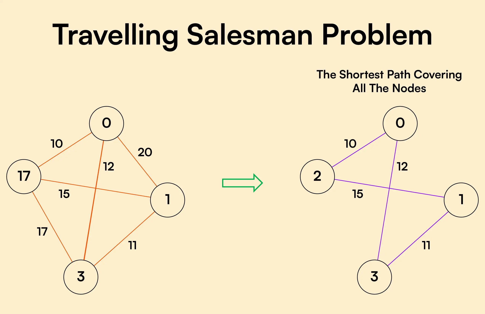
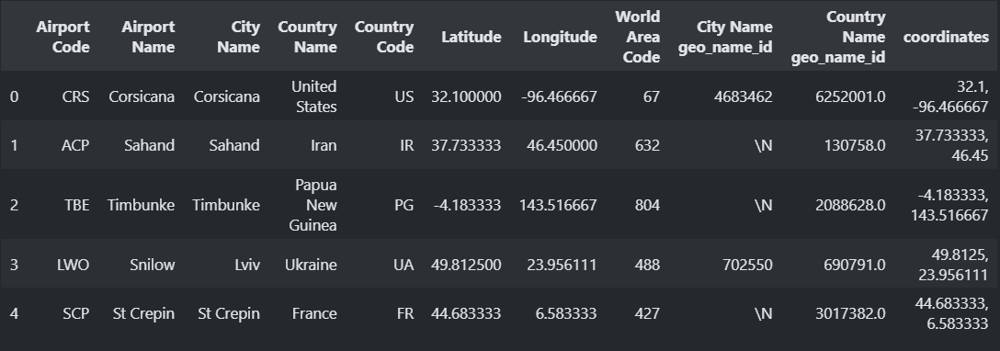
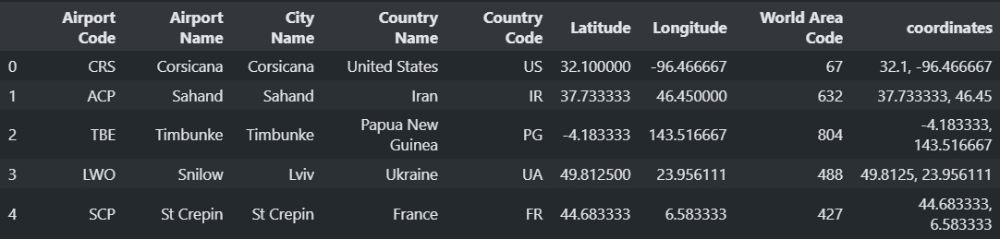
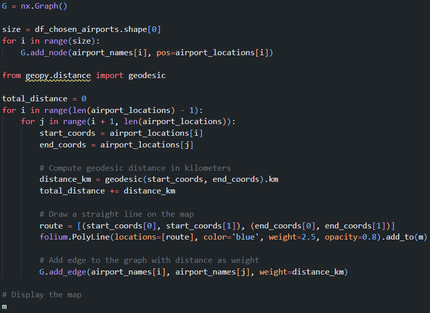
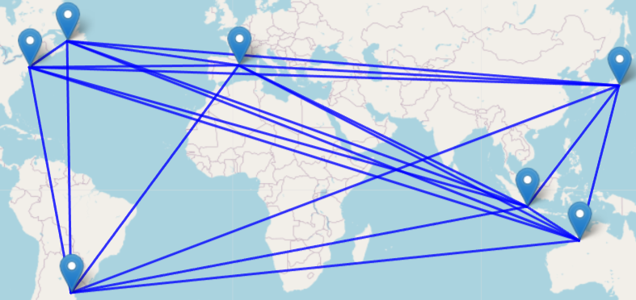
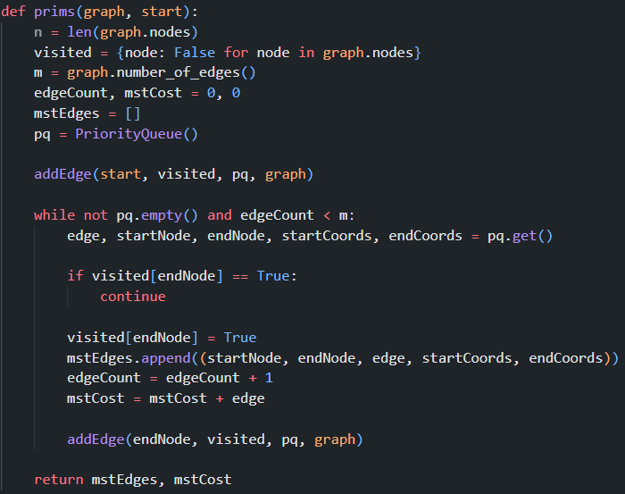
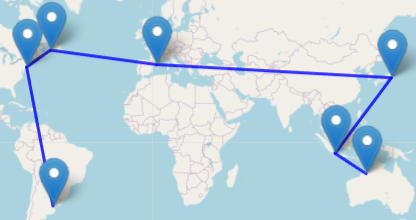

Final Project Website Repository: https://github.com/Graph-Theory-Coding-Project/Final-Project-Website


# ✈️ Fastravel ✈️

## Group Members
| Name                              | NRP         | Contribution          |
|-----------------------------------|-------------|-----------------------|
| Fadhil Revinno Hairiman           | 5025231002  | Website Creation & Frontend Development  |
| R. Rafif Aqil Aabid Hermawan      | 5025231069  | Project Planning, Quality Assurance, & Progress Report |
| Rogelio Kenny Arisandi            | 5025231074  | Algorithm Creation & Backend Development |
| Matteo Dennequin                  | 5999241043  | Project Planning, Quality Assurance, & Progress Report |


# Background
## Travelling the world
When planning a holiday around the world, it's important to optimize your journey, both to avoid too long journey times and to save money. So the idea is to put in place a tool that will give us the shortest path from a set of airports that we have entered in advance. Using Python, based on various notions seen in lessons during the semester, the tool FasTravel was born.


## Requirement Specificaiton
We wanted to make our tool as comprehensive as possible by offering users the option of searching all the world's airports, so that they can plan trips at both national and international level. 
To make our tool as accessible as possible, we need to provide visibility of the optimal path found. By using different data visualisation libraries and setting up a website, the user can obtain a clear and visible answer on a dynamic planisphere.

## Terminology

### Travelling Salesman Problem 



This optimization problem calls for the application of a TSP case. The Traveling Salesman Problem (TSP) is all about figuring out the shortest route for a salesperson to visit several cities, starting from one place and possibly ending at another. It's a well-known problem in computer science and operations research, with real-world uses in logistics and delivery.

Two main reasons stand out:
- The point of departure must also be the point of arrival. We need to return home after our incredible stay.
- For the sake of optimisation, and to vary our holidays, we'll only take the air route between two airports once: a Eulerian circuit.

### Prim's Algorithm


To aid in solving Travelling Salesman Problem we can represent the cities as a graph and solve the problem by creating a minimum spanning tree from that graph, and one of the ways to get MST is with Prim’s algorithm. 
  
Prim’s algorithm is a greedy algorithm that finds a minimum spanning tree for a weighted undirected graph. This means it finds a subset of the edges that forms a tree that includes every vertex, where the total weight of all the edges in the tree is minimized. The algorithm operates by building this tree one vertex at a time, from an arbitrary starting vertex, at each step adding the cheapest possible connection from the tree to another vertex.
  
This approach can speed up pathfinding by choosing the smallest path from two nodes which then can generate a path which the cost is never more than two times the cost of an optimal tour. 

### Hungarian Algorithm

WIP

# Methodology
## Dataset 
For this project we used the global airport database from Open Data Soft. 



This data contains Airport Codes, Airport Name, City name, Country Name, Country Code, Latitude, Longitude, World Area Code, City Name geo_name_id, Country Name geo_name_id, and coordinates. 



For our data preprocessing unnecessary columns from the table, which are City Name geo_name_id and Country Name geo_name_id, are dropped. After which our data preprocessing is complete and the remaining columns are used for the project.

## Graph Creation
Based on the processed data from before, we can use the longitude and latitude values to create a graph that will be used to calculate the shortest path. For our primary libraries that is used in the project : 
1. NetworkX is used to create graphs of the cities.
2. GeoPy is used to calculate distance between the cities based on the coordinates provided in the dataset.
3. Folium is used to represent the cities and its path in an OpenStreetMap view.



First nodes are created based on the selected cities, then the distance between cities will be calculated one pair at a time utilizing GeoPy and the provided coordinates of each city, during calculation a Folium line and point will be generated for visual representations later.



## Prim's algorithm
For our first implementation, Prim’s algorithm is utilized.


Two functions are created for this methodology, first is the addEdge function for creating a new graph after running an algorithm. 



Second is the Prim’s algorithm itself where standard implementation of the algorithm is utilized, which in the end will return the edge and the cost of the graph. 

After those functions have been created, then the algorithm can be executed by providing the previously created graph and a starting point which after execution a path in edge form from the provided starting point and the total distance is obtained. A map of the resulting tree can be generated from the resulting edge information to create a visual representation using Folium, after which a real distance of the tree is generated and the map representation is generated.



## Hungarian 

WIP

# Implementation


---

## Tech Stack
- **Backend**: Python (Flask framework)
- **Frontend**: HTML

---

## Required Dependencies
Make sure to install the following dependencies for this project to work:
- Flask
- Any other necessary Python libraries

Install the dependencies using:
```
pip install -r requirements.txt
```


---

## Project Structure

The project is structured as follows:


---

## Setting Up the Environment

To run the project locally:

1. Clone the repository:
   ```bash
   git clone https://github.com/Graph-Theory-Coding-Project/Final-Project-Website.git
   ```
2. Navigate to the project directory:
   ```bash
   cd Final-Project-Website
   ```
3. Install the required dependencies:
   ```bash
   pip install -r requirements.txt
   ```
4. Run the application:
   ```bash
   python app.py
   ```
5. Open your browser and navigate to `http://127.0.0.1:5000`.


---


## Displaying the Map

All calculations and rendering are handled by the backend using Python. The generated map is saved as `m_path_map.html` and displayed in the main HTML file using the `<iframe>` tag.

Example:
```html
<iframe class="rounded-xl" src="{{ url_for('static', filename='m_path_map.html') }}" width="1280" height="720"></iframe>
```

By placing the `m_path_map.html` file in the `static` folder, Flask automatically detects and serves it. If set up correctly, the map will appear as shown below:


---


## User Input

To enhance user experience, the application includes the following features:

- **Dropdown for Airport Selection**: Users can select airports in various countries.
- **Search Filter**: Helps users quickly find airports by city.
- **Uncheck All**: Allows users to reset their selections and plan a new trip.
- **Generate Map**: After selecting airports, users can click "Generate Map" to display the optimized travel plan.

Example interface:


---

## Contribution

Feel free to fork this repository, submit issues, and send pull requests. Contributions are always welcome!

---

## License

This project is licensed under the MIT License. See the `LICENSE` file for details.
```
